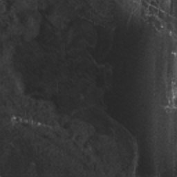

# Super Resolution of SAR images using GAN
An Implintation of a super resolution for SAR images based on the paper [SAR Image Super-Resolution Based on Noise-Free Generative Adversarial Network](https://ieeexplore.ieee.org/document/8899202).

The dataset used is taken from the [Capella Space Synthetic Aperture Radar (SAR) Open Dataset](https://registry.opendata.aws/capella_opendata/)

## Description
This project contains an implimintation of a super resolution Generial Adverserial Network (GAN) for SAR images.

## Setup
First make sure you have python 3.10.X installed. Then install the enviorment by following one of the following options.
Python VENV:
```bash
python3.10 -m venv superresSAR
source superres/bin/activate
pip install requirements.txt
```

Conda:
```bash
conda create --name superresSAR --python=3.10
conda activate superresSAR
pip install requirements.txt
```

## Training
In order to train the model you need to put the training images and validation images in different directories. Then run the following command:
```bash
python train_model.py --args --vars
```
where the possible arguments are:
1. epochs - number of epochs to train the model. (Default: 100)
2. batch_size - the batch size used for training and validation. (Default: 32)
3. learning_rate - the learning rate used to train the model. It is the same for the discriminator and generator. (Default: 0.001)
4. upscale_factor - Defines the multiplication factor for image enlargement. (Default: 2)
5. train_folder - Specifies the directory where the training datasets are stored. (Default: './train')
6. val_folder - Specifies the directory where the validation datasets are stored. (Default: './val')
7. wandb_key - Your Weights & Biases API key, needed for using Weights & Biases for experiment logging. (Default: '')
8. wandb_entity - The entity (user or team) under which the Weights & Biases runs will be logged. (Default: '')
9. use_logger - A boolean flag to decide whether to use a logger or not. (Default: False)

The training is done by reshaping the images to be by 256x256 and then lower scale it further by up_scale factor. Models are saved into the
models folder.

## Results
Here we display the low resolution, original image and the generator output for 2x upsampling.

Low resolution image:

High resolution image:

Upscaled image using generator network.


The validation score during training is:


the final SSIM score is 0.9273
